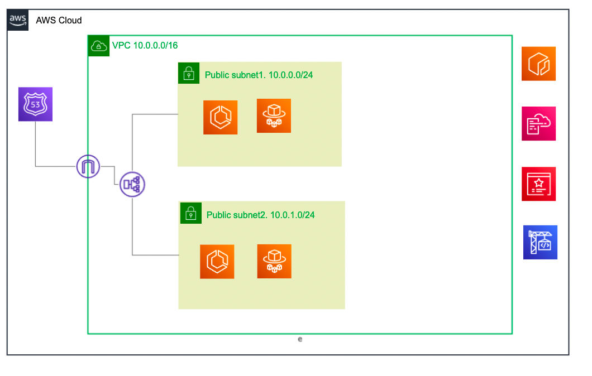

***React app with environment variables enabled***
https://www.freecodecamp.org/news/how-to-implement-runtime-environment-variables-with-create-react-app-docker-and-nginx-7f9d42a91d70/

-> Code build runs when commit message is in format 'xxxx [CodeBuild] xxxx' and pushed to main branch

Current Infra:

